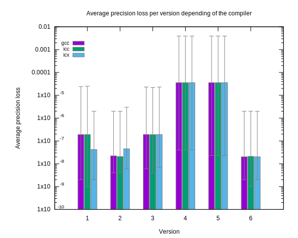

# Optimisation séquentielle du problème N-body

L'objectif de ce TP est d'améliorer les performances d'un algorithme simulant le problème de N-body en utilisant les compétences de HPC.
Au travers de ce rapport, nous allons passer de 5.6 +-0.1 Gflops jusque 33.5 +-0.1 Gflops, le tout en séquentiel uniquement, et avec une perte de précision inférieure à $10^{-8}$.

# Concept

On simule un univers avec n particules. Chaque particule commence avec des coordonnées aléatoires dans l'espace, et subit la loi gravitationelle de Newton des autres particules, loi qui peut se définir par une force proportionnelle à la masse de chaque objet et inversement proportionnelle au carré de leur distance. Ces forces sont calculés à chaque interval de temps dt, lesquelles permettent de mettre à jour la vitesse de migration de chaque particule et de facto leur position. Cette simulation est un problème commun en HPC appelé N-body, et plusieurs algorithmes existent pour la résoudre.
On s'intéresse ici à l'optimisation d'un de ces algorithmes, de complexité $O(n^2)$, qui même si n'étant pas le plus performant (il existe des algorithmes de complexité $O(n*log(n))$), est relativement simple à comprendre.

# Structure du code

Avant de s'intéresser aux optimisations effectués sur le code, on défini la structure de chaque version.

Chaque version contient :
- un fichier `nbody.c` contenant l'algorithme, ainsi que le calcul de mesure de performance. Plusieurs options peuvent être spécifiées à l'exécution
  - `-n=<nbodies>` Pour préciser le nombre de n-bodies.
  - `-s=<steps>` Pour spécifier le nombre d'itérations.
  - `-w=<warmups>` Pour spécifier le nombre d'itérations de "warmup".
  - `-t=<deltaTime>` Pour spécifier le pas temporel
  - `-d[=config.file]` Pour activer le mode debug.
  - `-c` Pour afficher la configuration utilisée.
  - `-h` Pour afficher le message d'aide.

> Par défaut, l'exécution se passe sur `16384` nbodies, avec `10` itérations et `3` de warmup, et un pas temporel de `0.01`.

- un `makefile`, lequel contient les options suivantes : 
  - `make nbody.gcc` : Compile le code avec `gcc`.
  - `make nbody.clang` : Compile le code avec `clang`.
  - `make nbody.icc` : Compile le code avec `icc`.
  - `make nbody.icx` : Compile le code avec `icx`.
  - `make all` : Compile le code avec les 4 compilateurs énoncés ci-dessus.
  - `make verif` : Exécute le code avec flag et configuration de debug, puis appelle `precision_checker.py` pour vérifier la précision de celui-ci.
  - `make clean` : Nettoyer les exécutables et autres fichiers temporaires
  <!-- - D'autres options, moins importantes, du type `make nbody.aocc` pour l'exécution avec `aocc`, spécifique à une architecture Amd, `make prof` pour du profilage, `make verifKNL`, `make verif_last` pour exécuter le code avec flag de debug, et vérifier la précision, sur le cluster ou par rapport à la précédente version.   -->

- un fichier `precision_checker.py` qui permet de calculer la moyenne des différences entre deux fichiers de débug. Prends en argument le fichier log baseline et celui à comparer.

> Les fichiers logs sont générés par `make verif`, avec la configuration suivante: `10000` nbodies, `1` itération et `0.01` en pas de temps. Les positions des 10000 particules sont écrites dans le fichier `out.dat`, lequel est lu par le script `precision_checker.py`

# Optimisations

Dans cette première partie, on s'intéresse aux améliorations effectuées, sans parallélisme.

On peut compter 7 versions ici.
- Version 0.0 Baseline
- Version 1.0 AOS -> SOA
- Version 2.0 SOA optimisé
- Version 3.0 SSE
- Version 4.0 SSE optimisé
- Version 5.0 AVX2
- Version 6.0 AVX512

> A noter que les versions 3.0, 4.0 et 5.0 n'ont pas d'améliorations de performances pures en comparaison de la version 2.0 , mais étaient nécessaires pour la version finale 6.

### Version 0.0
La version 0.0 ou Baseline, est la version fournie initialement. C'est une implémentation naïve de l'algorithme, sans améliorations.
Comme son nom l'indique, elle va nous servir d'exécution de base pour les mesures de performance ainsi que de précision.

> Note : Pour chaque version, les performances sont testés sur 20 itérations de mesure + 3 de warmup, avec 16384 bodies. Ces versions sont testés avec les compilateurs gcc, icc et icx. Pour certaines raisons, un header d'omp est manquant pour clang, celui-ci n'a donc pas été utilisé.

> Les tests de performances portent sur les compilateurs `gcc`, `icc`, `icx`. Malheuresement, de par la configuration du cluster, `clang` n'est utilisable uniquement sur le `knl03`, lequel était en gouverneur `powersave`. Les tests ont alors été réalisés sur le cluster `knl06`, un Intel® Xeon Phi™, d'architecture Knights Mill (7235?). Ce processeur est cadencé à 1.3Ghz sous gouverneur `performance` (malgré ce qui est écrit sur son model-name) et possède 1024Kb de cache size. Ses informations plus complètes peuvent être trouvés en annexe : [ici](cpuinfo.txt)
> 
> Il possède les flags relatifs à l'`avx512`, ce qui nous permet de réaliser notre dernière version écrite en intrinsèque `avx512`. Il supporte aussi SSE et AVX2.

> Pour les tests de précisions, exécuter `make verif` une première fois sur la version baseline pour générer le fichier debug à comparer.

### Version 1.0
La version 1.0 est la première optimisation et correspond uniquement au passage du stockage Arrays of Struct (AOS) vers Struct of Arrays (SOA).

Pour une perte de précision quasi nulle (Gcc) ou nulle pour icc et icx, en ayant une augmentation de performance significative, particulièrement en utilisant `gcc`.

### Version 2.0
La version 2.0 est celle qui regroupe le plus de petites améliorations scalaires.

- 2.1 : Réduction du nombre d'accès mémoire, par regroupement sous variables.
- 2.2 : Simplification du `pow` vers un `sqrtf` et une multiplication basique. Ce changement nous fait changer le nombre d'opérations flottantes de 2 vers 5, choix en partie arbitrairement, mais respectable étant donné la précision générale de l'exercice.
- 2.3 : Réduction du nombre de divisions. Passage d'une division à une multiplication de l'inverse.
- 2.4 : Alignement mémoire. Passage d'un `malloc` vers un `aligned_alloc`, permettant de réduire les accès mémoire en les regroupant. L'alignement mémoire a été effectué sur 64b, conformément au spécifications du processeur.
- 2.5 : Utilisation de flags d'optimisations plus aggressifs.
  - Utilisation des flags `-fp-model fast=2`, `-fast` plutôt que `-Ofast` et `-xhost`. Etonnament, même si ces flags sont sensés être compris dans `-fast`, de par mon utilisation, les rajouter en plus en ligne de commande semble réduire le temps d'exécution. Je n'ai pas de preuve tangible pour ceci, ce n'est qu'un ressenti, mais dans le pire des cas ils ne font que doublon.

De part toute ces modifications, on observe une nette augmentation de la performance, principalement dûe au remplacement du `pow` par un calcul de `sqrt`, mais est bien dépendante du compilateur. Le speedup est au minimum de 4.9 pour `gcc`, jusqu'à `22.2` pour icc.

Etonnament, la performance est calculée meilleure, d'environ 10x plus précise qu'en version SOA basique, malgré les flags d'optimisation plus aggressifs en précision flottante. Cela peut s'expliquer par une vectorisation moins regardante sur la précision sur le calcul du `pow`.

### Version 3.0

Vectorisation du code en utilisant SSE. Tout juste aussi précis que la version SOA non optimisé, avec des performances moyennes supérieures, mais bien éloignés de ce qu'on a pu obtenir avec la version 2.0. Les optimisations de la version 2.0 sont à reporter sur cette version.

Utilisation de la fonction `_hadd_ps` utilisée pour faire une somme horizontale d'un vecteur `__m128`, nécessaire au bon fonctionnement de l'algorithme.

Cette version ne représente pas grand intérêt d'un point de vue d'accélération du temps d'exécution, mais était nécessaire pour passer aux suivantes.

### Version 4.0

SSE, mais optimisé. Les améliorations suivantes ont été effectués : 

- 4.1 Utilisation d'une intrinsèque `rsqrt` plutôt que `sqrt`, celle-ci permettant l'inverse du `sqrt` directement en une seule instruction. Moins précis, mais bien plus rapide.
- 4.2 Utilisation de l'intrinsèque FMA plutôt que les intrinsèques addition et multiplication. Impact limité sur le temps d'exécution.
- 4.3 Minimisation du nombre de registres utilisés, par réutilisation de variables. Impact très limité sur le temps d'exécution.

### Version 5.0

Même configuration, mais utilisation d'AVX2.

On peut noter une réduction du temps d'exécution correspondant à un speedup d'un peu moins de 2, ce qui semble logique étant donné que la vectorisation en AVX2 permet de gérer deux fois plus de mémoire qu'en SSE.

La précision est sensiblement identique à la précédente version.

### Version 6.0

Même configuration, mais utilisation d'AVX512. Vectorisation par bloc de 16 flottants à simple précision. On atteint alors les performances maximales en séquentiel, pour cet algorithme.

Avec un speedup également d'environ 2x par rapport à la précédente version, on atteint les pic de 28.8 +- 0.1 Gflops avec `gcc`, un peu plus de 30.1 +-0.1 pour `icc` et finalement 33.3 +-0.2 Gflops avec `icx`, étant de loin le plus performant ici.

Par ailleurs, simplification de la fonction `_hadd_ps` par l'intrinsèque `_mm512_reduce_add_ps` intégrée.

Etonnament, une nette augmentation de la précision est calculée, de l'ordre de $10^3$ plus précis. Je ne saurais expliquer pourquoi une telle différence de précision.

# Annexes

[Lien Github](https://github.com/fm16191/N-body-Simulation)

[cpuinfo.txt](https://github.com/fm16191/N-body-Simulation/blob/master/cpuinfo.txt)

[Average precision loss](avg_precision.svg)

[Average performance improvement](avg_perf.svg)